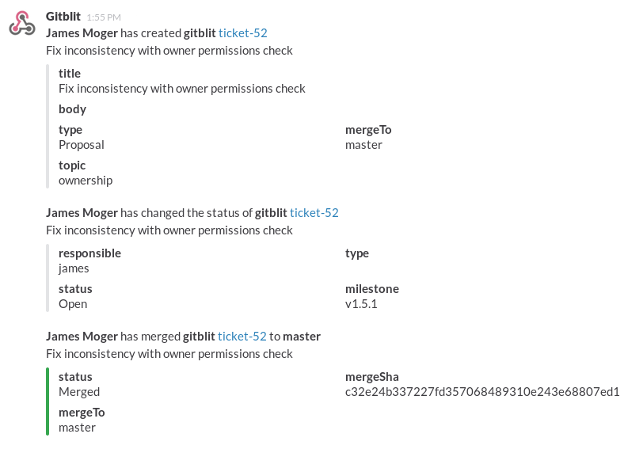

## Gitblit Slack plugin

*REQUIRES 1.5.0*

The Gitblit Slack plugin provides realtime integration for your Slack team.  The plugin inject events into a channel for branch or tag changes and ticket changes.

### Installation

This plugin is referenced in the Gitblit Plugin Registry and you may install it using SSH with an administrator account.

    ssh host plugin refresh
    ssh host plugin install slack
    ssh host plugin ls

Alternatively, you can download the zip from [here](http://plugins.gitblit.com) manually copy it to your `${baseFolder}/plugins` directory.

### Setup

At a bare minimum you'll need one setting configured in `gitblit.properties`.

    slack.url = https://hooks.slack.com/services/yada/yadayada

If you have the `powertools` plugin installed, you may configure this over SSH:

    ssh host gb config slack.url https://hooks.slack.com/services/yada/yadayada

There a handful of additional optional settings:

    slack.defaultChannel = general
    slack.useProjectChannels = false
    slack.postAsUser = true
    slack.defaultEmoji = 
    slack.gitEmoji = 
    slack.ticketEmoji = 
    slack.allowUserPosts = false
    slack.postPersonalRepos = false
    slack.postTickets = true
    slack.postTicketComments = true
    slack.postBranches = true
    slack.postTags = true

#### slack.postAsUser

By default this plugin will post events to your channels using the identity of the user triggering the event.  This will include gravatar thumbnails.  If this setting is disabled, events will be posted using the *Gitblit* identity and will use whatever you may have optionally specified for the *emoji* settings.

#### slack.*Emoji

You may specify emoji as `:name:` or you may specify complete urls.  These settings are ignored if you have enabled *slack.postAsUser*, which is enabled by default.

#### slack.allowUserPosts

*slack.allowUserPosts* allows users to send channel or direct messages from the command-line using the SSH command interface.

#### slack.useProjectChannels

*slack.useProjectChannels* allows you to shard Gitblit activity by the repository project.  This may fit better with any security model you may have in place.  These channels *must* already exist in Slack, the plugin will not create them for you.

How are project channels named?

1. if *slack.defaultChannel* is **empty**, the channel name is the first directory element of the repository path, unless there is no first directory element in which case activity will be posted to the default configured channel in Slack.
2. if *slack.defaultChannel* is **non-empty**, the channel name is *slack.defaultChannel* -project, where *project* is the first directory element of the repository path.  If *project* is empty, the *slack.defaultChannel* is used.

Examples:

<pre>
slack.defaultChannel = gb
slack.useProjectChannels = true
</pre>

- For the *network/a/b/myrepo.git* repository, the slack channel would be *#gb-network*.
- For the *test.git* repository, the slack channel would be *#gb*.

<pre>
slack.defaultChannel = 
slack.useProjectChannels = true
</pre>

- For the *network/a/b/myrepo.git* repository, the slack channel would be *#network*.
- For the *test.git* repository, the slack channel would be your default channel in Slack, likely *#general*.

### Usage

#### Ticket Hook

The ticket hook is automatic.

#### Receive Hook

The receive hook is automatic.

#### SSH Commands (optional)

This plugin also provides a generic mechanism to inject messages into a Slack channel.  These commands require administrator permissions or *slack.allowUserPosts=true*

    ssh host slack test
    ssh host slack send @james -m "'Hello from the Gitblit SSH command!'"

### Building against a Gitblit RELEASE

    ant && cp build/target/slack*.zip /path/to/gitblit/plugins

### Building against a Gitblit SNAPSHOT

    /path/to/dev/gitblit/ant installMoxie
    /path/to/dev/slack/ant && cp build/target/slack*.zip /path/to/gitblit/plugins

